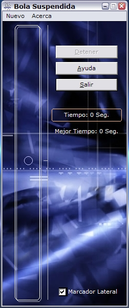



## Bola Suspendida

### Description

Very nice ability game in which you have to keep the ball floating inside a rectangle without touching its edges. As time passes, it gets smaller and smaller!! The game includes a background image and sound effects. Hope you like it.
 
### More Info
 

             |
---                |---
**Submitted On**   |2005-06-27 13:54:50
**By**             |[Diego Caivano](https://github.com/Planet-Source-Code/PSCIndex/blob/master/ByAuthor/diego-caivano.md)
**Level**          |Intermediate
**User Rating**    |5.0 (15 globes from 3 users)
**Compatibility**  |VB 6\.0
**Category**       |[Games](https://github.com/Planet-Source-Code/PSCIndex/blob/master/ByCategory/games__1-38.md)
**World**          |[Visual Basic](https://github.com/Planet-Source-Code/PSCIndex/blob/master/ByWorld/visual-basic.md)
**Archive File**   |[Bola\_Suspe1917977272005\.zip](https://github.com/Planet-Source-Code/diego-caivano-bola-suspendida__1-61334/archive/master.zip)

